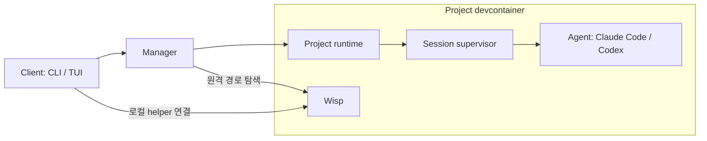

# cxz 용어집

현재 구현을 기준으로 구성요소, 실행 위치, 데이터의 이름을 정리한다.
문서와 이슈에서는 중앙 서버를 **Manager**, 프로젝트 안의 cxz 서버를
**Project runtime**, 세션 실행 관리자를 **Session supervisor**로 구분한다.

## 실행 구성요소

| 용어 | 실행 위치 | 역할과 수명 |
| --- | --- | --- |
| **Client / Frontend** (클라이언트) | 사용자의 로컬 또는 원격 접속용 컴퓨터 | `cxz` CLI·TUI. Manager에 요청하고 결과를 표시한다. 클라이언트를 종료해도 에이전트 세션은 계속 실행된다. |
| **CLI** | 클라이언트 | `cxz project …`, `cxz session …` 등의 명령 인터페이스. 서브커맨드는 TUI에 attach하지 않는다. |
| **TUI** | 클라이언트 터미널 | 서브커맨드 없이 `cxz`로 여는 터미널 UI. `cxz --endpoint NAME_OR_URL`로 원격 연결도 연다. |
| **Manager** (중앙 관리 서버) | 기본 설치에서는 전용 Manager 컨테이너 | 프로젝트 등록·컨테이너 준비·계정 관리·요청 라우팅·이벤트 캐시 등을 담당한다. `cxz install`로 설치하며, 개발용 `cxz manager serve`는 서버를 포그라운드로 실행한다. |
| **Project runtime** (프로젝트 런타임 서버) | 프로젝트 devcontainer | 해당 프로젝트의 세션 API와 실행 관리를 담당하는 cxz 서버. 내부 진입점은 `cxz _project`다. |
| **Session supervisor** (세션 실행 관리자) | 프로젝트 devcontainer | 개별 세션의 에이전트 프로세스, 프로토콜 입출력, 승인, 상태와 journal을 관리한다. 내부 진입점은 `cxz _supervise SESSION`이다. Manager·TUI와 별도 프로세스다. |
| **Agent** (에이전트) | 프로젝트 devcontainer, Supervisor의 자식 프로세스 | 실제 작업을 수행하는 Claude Code 또는 Codex 프로그램. Claude는 headless 스트림, Codex는 `codex app-server` 프로토콜로 연결한다. |
| **Wisp** (워크스페이스 보조 프로세스) | 프로젝트 devcontainer의 remote user 권한 | 경로 탐색과 `@redact` 임시 비밀 파일 처리를 위한 내부 helper. `cxz wisp`를 Docker exec로 실행하고 stdio 연결을 재사용한다. 연결을 소유한 TUI 또는 Manager의 수명을 따르며, 세션 실행을 관리하지 않는다. |
| **Token broker** (토큰 공급 기능) | Manager 측 | 중앙 Codex 계정의 access token을 허가된 Project × Account에 공급한다. 세션 Supervisor나 Wisp와 구별한다. |
| **Shared Docker engine / DinD** (공유 Docker 엔진) | 별도 Docker-in-Docker 컨테이너 | 프로젝트들이 Docker 작업에 사용하는 공용 엔진. 호스트 Docker daemon과 별개이며, 이미지·빌드 캐시·내부 볼륨을 별도 저장한다. |

기본 설치의 실행 관계는 다음과 같다. 화살표는 주요 요청·프로세스 제어 경로이며,
모든 기능이 하나의 경로를 통과한다는 뜻은 아니다.

Wisp의 연결 방식은 [Wisp](wisp.md), 비밀 파일의 저장 위치와 보존 정책은
[@redact](redact.md), 중앙 토큰 공급은 [Agent Accounts](accounts.md#codex-중앙-공급)를 참고한다.

## 혼동하기 쉬운 이름

| 표현 | 구분 기준 |
| --- | --- |
| **Wasp / wasp** | 일부 기존 문서에서 세션을 계속 실행시키는 구성요소를 가리키던 표기. 현재 소스에는 별도 Wasp 구현·명령이 없다. 해당 문맥은 **Session supervisor**로 표기한다. **Wisp의 별칭으로 쓰지 않는다.** |
| **daemon / server** | 상주 프로세스·서버를 뜻하는 일반 표현. cxz Manager, Project runtime, Codex app-server, Docker daemon 중 무엇인지 명시한다. `daemon.sock`이라는 파일명만으로 서버 계층을 구분할 수 없다. |
| **호스트 서버** | 중앙 cxz 서버를 뜻한다면 **Manager**라고 쓴다. 기본 설치의 Manager는 호스트 OS에 직접 실행되는 프로세스가 아니라 컨테이너 안에 있다. |
| **에이전트 서버** | 프로젝트 안의 cxz API 서버는 **Project runtime**, 에이전트 실행 관리자는 **Session supervisor**, Codex 자체 서버는 **Codex app-server**로 구분한다. |
| **Host / Docker engine host** | 클라이언트가 실행되는 컴퓨터와 Docker 엔진이 실행되는 시스템은 다를 수 있다. Docker bind 경로를 설명할 때는 **Docker engine host**를 명시한다. Docker Desktop에서는 Linux 엔진 VM일 수 있다. |
| **Runtime** | 이 문서에서 단독으로 쓰면 cxz **Project runtime**을 뜻한다. 에이전트 프로그램 내부의 실행 체계를 말할 때는 **Codex 런타임**, **Claude Code 런타임**처럼 주체를 붙인다. |

## 프로젝트와 실행 단위

| 용어 | 뜻 |
| --- | --- |
| **Installation** (설치) | 소유권 식별자와 Manager, 관련 컨테이너·볼륨·네트워크를 공유하는 cxz 설치 단위. 호스트의 `--state` 디렉터리는 설치 위치를 찾는 locator와 클라이언트 설정을 보관한다. |
| **Workspace** (워크스페이스) | 작업 소스 디렉터리. 프로젝트 식별에는 정규화된 절대 경로를 사용한다. 컨테이너 안의 workspace 경로는 호스트 경로와 다를 수 있다. |
| **Project** (프로젝트) | Workspace를 cxz에 등록한 리소스. 표시 이름·alias·컨테이너·상태 볼륨·세션들을 연결한다. 컨테이너를 내리거나 재생성해도 같은 프로젝트 등록과 볼륨을 유지할 수 있다. |
| **Devcontainer / Project container** | 프로젝트의 도구와 실행 환경을 제공하는 컨테이너. Project 리소스 자체와 구별한다. |
| **Session** (세션) | 이어서 사용할 수 있는 에이전트 대화 단위. Project와 Account에 연결되며 기록과 provider 대화 식별자를 가진다. 같은 프로젝트에 여러 세션이 있을 수 있다. |
| **Run** (실행 회차) | 세션을 시작·재개하여 실행하는 한 회차. 같은 Session도 중지 후 재개하면 새 Run이 된다. 오래된 회차의 승인·입력을 구분하는 데 Run ID를 사용한다. |
| **Turn** (턴) | 한 Run 안에서 사용자 입력을 처리하는 작업 회차. 여러 모델 응답과 도구 호출을 포함할 수 있다. |
| **Tool call / Tool result** (도구 입력 / 결과) | 에이전트가 도구에 전달한 요청과 반환된 결과. 작업 상세보기의 Input·Output 탭에서 확인한다. |
| **Name / Alias / ID** | Name은 표시 이름, Alias는 짧은 조회용 이름, ID는 식별자다. 프로젝트 표시 이름을 바꿔도 프로젝트의 식별은 유지된다. |

## 계정과 인증

| 용어 | 뜻 |
| --- | --- |
| **Account** | Claude/Codex 로그인 프로필. cxz 사용자·tenant를 뜻하지 않는다. |
| **AgentKind** | `claude` 또는 `codex`. 실행할 에이전트 종류이며 모델 이름과 구별한다. |
| **Provider / Vendor** | 모델 또는 에이전트의 공급 주체를 가리키는 표현. 구체적인 문맥에서는 공급자와 에이전트 종류를 명시한다. |
| **Model** | 에이전트가 사용하는 모델. Account나 AgentKind와 별도의 선택이다. |
| **AuthBackend** | 로그인 방식, 인증 범위, 갱신 주체를 결정하는 전략. 현재 `project-local-oauth`, `brokered-access-token` 등이 있다. |
| **AuthBinding** | Account와 Project의 인증 사용 범위를 연결하는 리소스. 연결이 존재하는 것과 로그인이 성공한 것은 별개다. |
| **Capability** | 정해진 프로젝트·계정 또는 런타임 접근 권한을 증명하는 비밀 값. 공개 ID·Alias와 구별한다. |

인증 범위와 에이전트별 기본값은 [Agent Accounts](accounts.md)를 참고한다.

## 상태와 기록

| 용어 | 뜻 |
| --- | --- |
| **Journal** (이벤트 저널) | 입력·응답·도구·승인·상태 변경 등을 순서대로 보존하는 내구성 기록. 런타임 복구의 근거이며 화면에 표시된 대화보다 많은 원본 정보를 포함한다. |
| **Transcript** (대화 표시) | Journal 이벤트를 사람이 읽을 수 있도록 구성한 대화 화면. 도구 결과 등을 축약해서 보여줄 수 있다. |
| **Manifest** | 프로젝트·세션을 복구하고 실행하기 위한 저장 메타데이터. |
| **Projection / Cache** | Journal이나 런타임 상태를 조회하기 편하게 DB에 반영한 값. 전체 상태 볼륨·원본 기록의 백업을 대체하지 않는다. |
| **Resource DB** | Project·Session·Account 등의 리소스 및 audit 정보를 보관하는 `resources.db`. `cxz.db`의 런타임 레지스트리·이벤트 캐시와 구별한다. |
| **State volume** (상태 볼륨) | 컨테이너 교체와 별개로 상태·기록을 유지하는 Docker named volume. 컨테이너의 writable layer와 수명이 다르다. |
| **Context** (컨텍스트) | 에이전트가 모델 요청에 사용하는 현재 작업 정보. 저장된 전체 Journal과 크기·내용이 같지 않을 수 있다. |
| **Compaction / Compact** (컨텍스트 압축) | 에이전트가 컨텍스트를 요약·정리하는 동작. cxz의 전체 Journal을 삭제하는 작업은 아니다. |

이벤트 조회와 캐시는 [리소스 갱신과 대화 로딩](resource-refresh.md),
공유 Docker 엔진은 [Shared Docker engine](managed-docker.md)을 참고한다.
