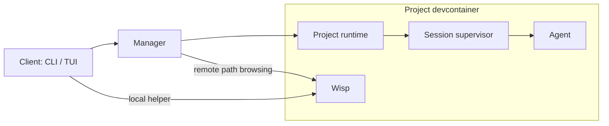

# Glossary

Names for the parts, so documents and issues can be specific about which one they
mean.

## Processes

| | Runs in | Does |
|---|---|---|
| **Client / Frontend** | Your machine | The `cxz` CLI and TUI. Closing it does not stop an agent. |
| **Manager** | Its own container | Owns projects, accounts and containers; routes requests; caches events. One per installation. Started by `cxz install`; `cxz manager serve` runs it in the foreground for development. |
| **Project runtime** | The project devcontainer | The session API and execution management for one project. Internal entry point `cxz _project`. |
| **Session supervisor** | The project devcontainer | Owns one session's agent process, protocol I/O, approvals, state and journal. Internal entry point `cxz _supervise SESSION`. A separate process from the manager and the TUI. |
| **Agent** | The project devcontainer, a child of the supervisor | Claude Code or Codex itself. Claude over a headless stream, Codex over `codex app-server`. |
| **Wisp** | The project devcontainer, as the remote user | A helper for container path browsing and `@redact` temporary files. Not a session daemon — it does not run conversations. Lives as long as the connection that opened it. |
| **Token broker** | Manager side | Supplies a central Codex account's access token to the projects that account is bound to. |
| **Shared Docker engine** | A Docker-in-Docker container | The engine projects use for their own Docker work. Separate from your host daemon, with its own images, cache and volumes. |

## Units of work

| | |
|---|---|
| **Installation** | One ownership identity, one manager, and the containers, volumes and networks they own. |
| **Workspace** | A source directory. Identified by its canonical absolute path. The path inside the container may differ. |
| **Project** | A workspace registered with cxz: display name, alias, container, state volumes, sessions. Survives its container being removed or rebuilt. |
| **Devcontainer / Project container** | The container providing a project's tools. Distinct from the project resource itself. |
| **Session** | One resumable conversation. Bound to a project and an account, with its own history and provider conversation ID. A project may have many. |
| **Run** | One execution of a session. Stopping and resuming makes a new run. Run IDs are how stale approvals and inputs are recognised. |
| **Turn** | One user input being processed within a run. May contain many model replies and tool calls. |
| **Tool call / result** | What the agent sent a tool and what came back. The Input and Output tabs of `/details`. |

## Identity

| | |
|---|---|
| **Name** | A display name. May contain spaces, need not be unique. |
| **Alias** | A short unique handle for lookups. |
| **ID** | The identifier. Renaming never changes it. |
| **Account** | An agent authentication profile. Not a cxz user or tenant. |
| **AgentKind** | `claude` or `codex`. Not a model name. |
| **Model** | What the agent asks. Chosen separately from the account and the agent kind. |
| **AuthBackend** | The login strategy: how it happens, its scope, who refreshes it. Currently `project-local-oauth` and `brokered-access-token`. |
| **AuthBinding** | The recorded association between an account and a project. Existing is not the same as logged in. |
| **Capability** | A secret proving access to a specific project, account or runtime. Not an ID or alias. |

## State

| | |
|---|---|
| **Journal** | The durable, ordered record of inputs, replies, tool activity, approvals and state changes. The basis for recovery. Holds more than the transcript shows. |
| **Transcript** | The journal rendered for reading. Abbreviates tool results. |
| **Manifest** | Stored metadata needed to recover and run a project or session. |
| **Projection / Cache** | Journal or runtime state mirrored into a database for querying. Not a substitute for backing up the volumes. |
| **Resource DB** | `resources.db`: projects, sessions, accounts and audit rows. Distinct from `cxz.db`, the runtime registry and event cache. |
| **State volume** | A named Docker volume holding state and history, outliving any container's writable layer. |
| **Context** | What the agent currently sends the model. Not the same size or content as the stored journal. |
| **Compaction** | The agent summarising its own context. Does not delete the cxz journal. |

## Names to avoid

| | |
|---|---|
| **Wasp** | Used in some older documents for whatever keeps a session running. There is no such component. Say **session supervisor**. Never use it for Wisp. |
| **daemon**, **server** | Too vague. Say which: cxz manager, project runtime, Codex app-server, Docker daemon. `daemon.sock` in a path does not tell you which layer. |
| **host server** | If you mean the central cxz server, say **manager**. In a default installation it is in a container, not a host process. |
| **runtime** | Alone, means the cxz **project runtime**. For an agent's internals say **Codex runtime** or **Claude Code runtime**. |
| **host** | The machine running the client and the machine running the Docker engine can differ. When paths are involved, say **Docker engine host**. |
