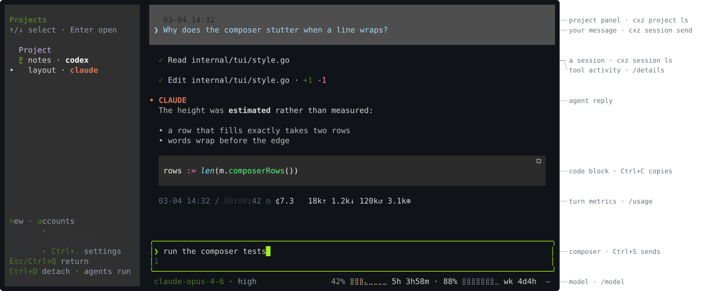
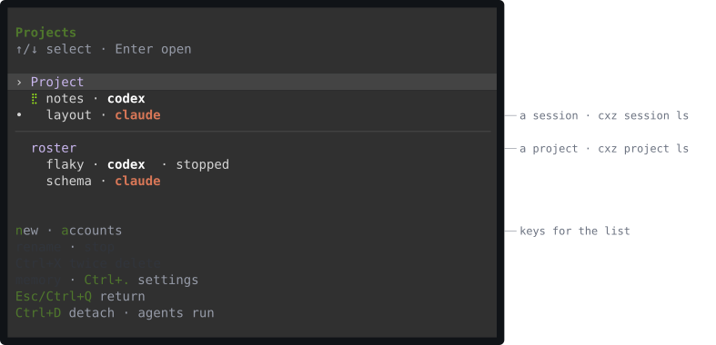
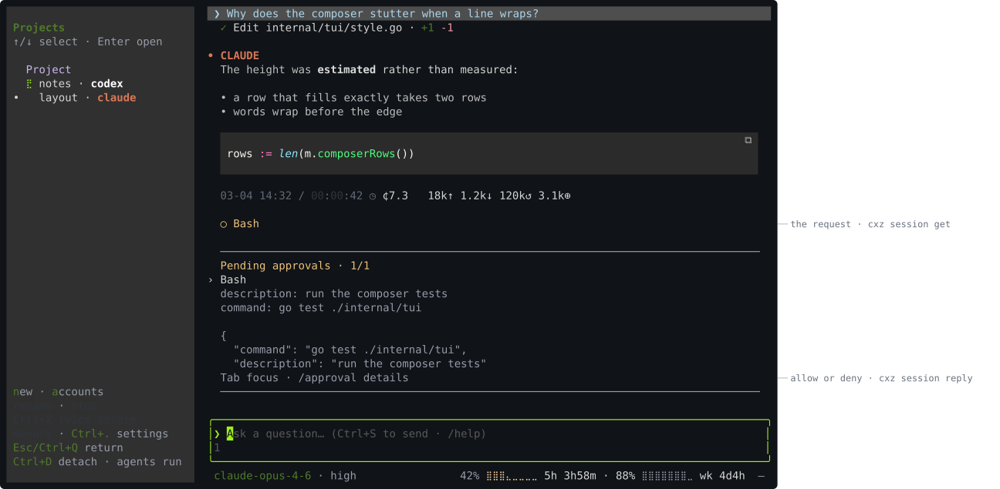

# Screens, part by part

The TUI is the only interactive surface and every subcommand prints and exits,
so the two never meet on screen. This page names the parts of each screen and
gives the command that reaches the same thing from a script — and says plainly
where there is no such command.

The figures are drawn by the TUI itself: the same renderer, the same palette,
rendered to SVG rather than photographed, so they are text, a few kilobytes, and
cannot show a screen the code no longer produces. See
[development](development.md#documentation-figures).

## The session screen

| Part | What it is | From a script |
|---|---|---|
| Project panel | Every project and its sessions. `•` marks the one you are in | `cxz project ls` |
| Session row | `alias · agent`; a working one turns a spinner | `cxz session ls`, `cxz session get ALIAS` |
| Your message | Local timestamp, shaded; no `YOU` label | `cxz session send ALIAS "text"` |
| Tool activity | One row per call, marker updated in place, `+N -N` for edits | `/details`; `cxz session events ALIAS` |
| Agent reply | `• CLAUDE` or `• CODEX`, then the text | `cxz session events ALIAS` |
| Code block | Highlighted, shaded, with a copy button | `Ctrl+C` copies the original, not the wrapping |
| Turn metrics | Duration, cost, then `↑` input `↓` output `↺` cache read `⊕` cache write | `/usage` |
| Composer | `Ctrl+S` sends; the draft is local and never leaves this process | `cxz session send` |
| Status bar, left | Model, and reasoning effort once the provider confirms one | `/model`; the default is `cxz config set claude-model ID` |
| Status bar, right | Provider-reported **remaining** quota, window label, reset countdown | `/usage`; the raw usage events are in `cxz session events ALIAS`, nothing prints the bar |

The colours carry meaning the text does not: bright green is where the keyboard
is, a tool marker is green when it finished and red when it did not, `+N` is
green and `-N` red, and the quota bar only takes on colour as the quota drops.
That is the reason this page has pictures at all.

## The project list

The same rows as the panel, on their own screen when the terminal is too narrow
to hold both. Sessions are listed under the project they belong to.

| Key | What it does | From a script |
|---|---|---|
| `↑` `↓`, `Enter` | Select and open | — opening is a TUI idea; a script sends instead |
| `n`, `Ctrl+N` | New session: pick an account, log in if needed | `cxz session new --account ACCOUNT WORKSPACE` |
| `a` | Accounts | `cxz account ls`, `cxz account add`, `cxz account login` |
| `r` | Rename the selected session | — for projects, `cxz project set --name --alias` |
| `s` | Stop it | `cxz session stop ID` |
| `Ctrl+R` | Resume it | `cxz session resume ID` |
| `Ctrl+X` twice | Delete: frees the alias, keeps the journal | — the CLI only has `cxz session purge`, which destroys |
| `m` | Browse retained memory and history | — no command |
| `Ctrl+.` | Settings: versions, channel, manager image, MCP | `cxz use`, `cxz self-update status`, `cxz mcp list` |

## A pending approval

A request appears twice: as a row in the transcript, where its marker is still
open, and in the box above the composer, which carries the parsed fields and the
raw payload. `Tab` moves focus to the box, `F2` allows, `F3` denies, and
`/approval` shows the payload in full rather than the first lines of it.

| Part | What it is | From a script |
|---|---|---|
| `○ Bash` | The request in the transcript, not yet decided | `cxz session get ID` lists what is pending |
| `Pending approvals · 1/1` | How many are waiting, and which one is shown | `cxz session get ID` |
| Parsed fields | What the provider said the call is | `cxz session events ID` |
| Raw payload | The request as it arrived, scrolled | `/approval` |
| `F2` / `F3` | Allow or deny | `cxz session reply ID REQUEST_ID allow\|deny` |
| A question dialog | The same request shape with answers | `cxz session reply ID REQUEST_ID allow ANSWERS_JSON` |

`REQUEST_ID` is the request's own id from `cxz session get`, not the sequence
number of the event that carried it.

## Where the two surfaces do not meet

Only in the TUI: opening a conversation, the memory browser, deleting a session
without destroying it, renaming a session, `/compact`, `/context`, `/usage`,
diagnostic recordings (`F9`), and the sound a finished turn makes.

Only in the CLI: `cxz install` and `cxz uninstall`, `cxz up` / `cxz down`,
`cxz project recreate`, `cxz project shell` and `exec`, `cxz devcontainer render`,
`cxz edit`, `cxz github sync` and `cxz gitconfig sync`, `cxz docker`, `cxz use`
and `cxz self-update`, `cxz expose`, and both purges.

Both, with the same effect: sending a message, replying to an approval,
interrupting, stopping and resuming a session, creating one, and listing
projects, sessions and accounts.

See [the TUI](tui.md) for keys, slash commands and how to read a conversation,
and [the CLI reference](cli.md) for every command.
