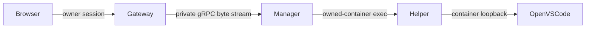

# Conversation and workspace editor

The available conversation area excludes the resource sidebar and session panel.
At **1600px or wider**, its left column is **800px** and a 1px divider separates
it from the workspace editor, which fills the remainder. The conversation and
composer retain their existing centered 600px content width. Below that threshold
the editor hides and conversation fills the available area. Resizing does not
reset the draft, file tabs or connection. On narrower screens no editor code is
loaded until the wide layout has first been activated.

## File preview

The initial view lists the selected session's **project** workspace, not an agent's
account/configuration directory. Directories expand on demand. UTF-8 text files
open in a read-only, monochrome Monaco editor with line numbers and Find. The
editor and its worker load only when a file is opened; the conversation startup
bundle does not include Monaco. Preview limits are 1 MiB per file, 16 cached tabs
per project and 2048 entries per directory. Binary/non-UTF-8 files report an error.
Refresh reloads the directory tree; reopening a closed file reads it again.

Tabs, reading positions and the connection state belong to the current
authenticated browser Connection and project. Sessions in the same project share
them. Switching projects isolates them. Reload/sign-out discards this in-memory
state. File browsing requires a running project container and a resolved
`remoteWorkspace`; existing `ProjectService.Paths`/`Download` operations run as
that project's remote user. The gateway additionally rejects paths lexically
outside that workspace and bounds download bytes. This is a navigation boundary,
not a filesystem sandbox for symlink targets or a restriction on the owner's IDE.

## Connect to the devcontainer

**Connect** starts/reuses pinned **OpenVSCode Server 1.109.5** inside the existing,
running project container and embeds its workspace at the same origin. It uses
the project's resolved `remoteUser` and `remoteWorkspace`; it does not launch a
second container or adopt an unregistered/foreign one. A stopped project reports
that it must be started first. **Disconnect** closes the embedded view and returns
to the read-only preview; it leaves the project and private editor process running.
The IDE's first-use workspace trust prompt remains available for the user.
The embedded workbench is displayed in grayscale; its own theme/settings remain
available in VS Code.

Supported containers are glibc Linux amd64/arm64. The first Connect downloads the
matching official archive through the Manager (about 73 MiB for amd64), verifies a
pinned SHA-256, caches it in Manager state, and installs it under the remote user's
`~/.cache/cxz-editor`. The user's passwd home is used even when `docker exec`
inherits a different `HOME`. Installation is locked, staged, size-bounded and
rejects archive traversal/unsafe symlinks. The project user needs a writable home.
Alpine/musl and other architectures require a different distribution; this version
does not install a compatibility layer. No Node/npm is needed on the Manager host.

The server listens only at `127.0.0.1:7351` **inside** the project container.
No editor port is published. The installed web gateway still has no Docker socket
or database mount. HTTP and WebSocket traffic follows this route:



The Manager checks container owner/project labels and running state for startup
and each tunnel. Browser RPCs cannot invoke the raw `EditorTunnel` method. The
Manager's Editor reply token is removed from the browser RPC reply. The workbench
needs its token for its own WebSocket control handshake, so the gateway sets a
Secure, SameSite=Strict, session cookie readable by the workbench, scoped to
`/editor/PROJECT/`. It forwards only that private cookie upstream, never the cxz
owner cookie. Gateway owner authentication remains required for every HTTP and
WebSocket request, and logout/expiry cancels active upgraded connections. Token
values are not placed in iframe URLs or cxz's localStorage.

Monaco generates style elements and inline style attributes; the main UI CSP
allows those styles explicitly while retaining `script-src 'self'`. Worker and
iframe sources are same-origin (worker blobs allowed). Sanitized message HTML
still cannot supply style attributes. The embedded IDE retains its own CSP, with
framing restricted to the same origin.

OpenVSCode is a full workspace IDE after Connect: edits, terminals and extensions
have the selected project user's permissions. It is not the read-only preview.
See the [official OpenVSCode project](https://github.com/gitpod-io/openvscode-server)
and [Monaco project](https://github.com/microsoft/monaco-editor).

## WASM fake connection and browser Linux review

The [design sandbox](web-sandbox.md) uses the same generated ProjectService and
React components. Its in-memory Go/WASM service implements Paths, Download and
Editor with separate fixture files for each project. Connect waits for the
configured pace, reports **Simulated connection**, and keeps the read-only viewer;
Disconnect restores File preview. This needs no network/container/account and
exercises resizing, file tabs, project isolation, connection state and drafts.
It does **not** simulate a full VS Code workbench or terminal.

Running Linux inside a browser is possible, but is a separate execution backend
from this Go/WASM simulator. The experimental
[VS Code container WASM project](https://github.com/ktock/vscode-container-wasm)
uses [container2wasm](https://github.com/container2wasm/container2wasm) to run a
converted container/VM and VS Code locally in the browser. That can provide a
more complete offline IDE demo, including a virtual Linux filesystem.

It adds container-image conversion/distribution, VM boot and memory overhead,
filesystem persistence, and a browser-to-guest connection layer. Its shared-memory
support needs cross-origin isolation/SharedArrayBuffer; browser networking still
has HTTP/CORS constraints rather than ordinary Linux networking. A browser VM
also cannot transparently connect to this installation's real Docker workspace.
The sandbox already serves cross-origin isolation headers for its Go worker;
this feature does not add a Linux backend or VM assets. For UI work the
small deterministic fake connection is the default; a Linux/IDE VM demo can be
an optional, independently loaded scenario if that behavior needs to be tested.

## Verification

- Sandbox browser test checks the 1599/1600px available-area boundary, 800px
  conversation, readonly files, fake Connect, resize/draft preservation, and
  project isolation/restoration.
- Production browser test loads the actual Monaco preview under the gateway CSP.
- Native gateway test covers unauthorized requests, RPC token removal, the
  workbench cookie scope, preview size/path limits, HTTP/WS bytes and logout
  revocation.
- Opt-in real browser probe uses a disposable container's OpenVSCode server through
  the gateway: `CXZ_EDITOR_PROBE_CONTAINER=NAME npm --prefix ts run test:browser`.
  The fixture expects `/tmp/cxz` in that owned test container and a README containing
  `Editor probe`; it never starts/adopts a production project.
- Opt-in Manager test installs/reuses the pinned release as a non-root user,
  checks actual workbench HTML through its Docker tunnel, and rejects foreign or
  stopped containers:

```sh
go build -o /tmp/cxz-editor-probe ./cmd/cxz
CXZ_TEST_EDITOR=1 CXZ_TEST_BINARY=/tmp/cxz-editor-probe \
  go test ./internal/workspace -run TestEditorDocker -count=1 -v
```

`CXZ_TEST_EDITOR_IMAGE` can select an existing Debian/glibc test image.
`CXZ_TEST_EDITOR_ARCHIVE` can supply an already downloaded official archive for
the Manager cache; its digest is still verified. Default image: debian:bookworm-slim.
These opt-in tests create disposable containers and remove them on completion.
